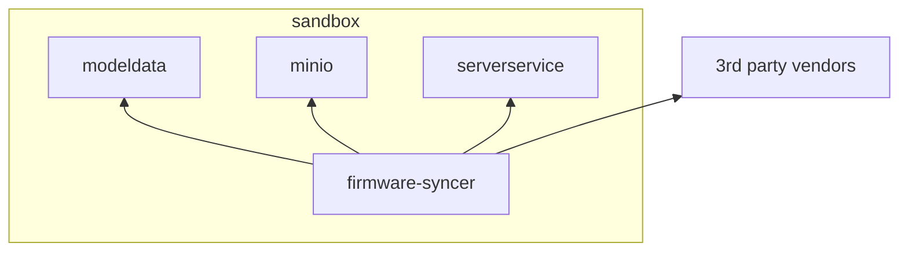

# Firmware Syncer Test Environment Setup

Additional services and resources can be deployed post setup to create an environment for testing the `firmware-syncer`.

## Architecture



The test environment creates a few new resources:
- An nginx server that hosts the `modeldata.json`.
- A minIO server to host an S3 bucket.

The firmware-syncer still needs internet access to download the firmware files from the various 3rd party sites.

## Deploy Services

Run the make target to deploy and setup the services

```shell
make firmware-syncer-env
```

You should now see a minio deployment with a pod, and a modeldata deployment with a pod.

## Cleanup

Cleanup the changes made for firmware-syncer:

> Note: The cleanup does a helm rollback to the previous release.
>       If you have made changes with helm since deploying the firmware-syncer environment,
>       you may not want to do this.

```shell
make firmware-syncer-env-clean
```

## Running a firmware-syncer job

A firmware-syncer job can be run with a make command:

```shell
make firmware-syncer-job
```

The job can also be removed with the corresponding cleanup command:

```shell
make firmware-syncer-job-clean
```

## Accessing the S3 storage

The S3 port can be accessed at `http://localhost:9000` with port-forwarding:

```shell
make port-forward-minio
```

You should be able to use your favorite S3 tool or browser to connect to the S3 bucket.

Credentials:
- The accessKey is `accessKey`
- The secretKey is `secretKey`
- The bucket is `bucket1`

If you do not have a tool or browser, you can use the minio client:

Installation:
https://min.io/docs/minio/linux/reference/minio-mc.html#install-mc

Configure `mc` to access the server:

> Note: Setting up the server alias is necessary everytime the minio server is deployed/redeployed.

```shell
mc alias set minio http://localhost:9000 accessKey secretKey
```

List contents of the server:

```shell
mc ls minio
```

List contents of the bucket:

```shell
mc ls minio/bucket
```

Tree view of the files in the bucket:

```shell
mc tree -f minio/bucket1
```
